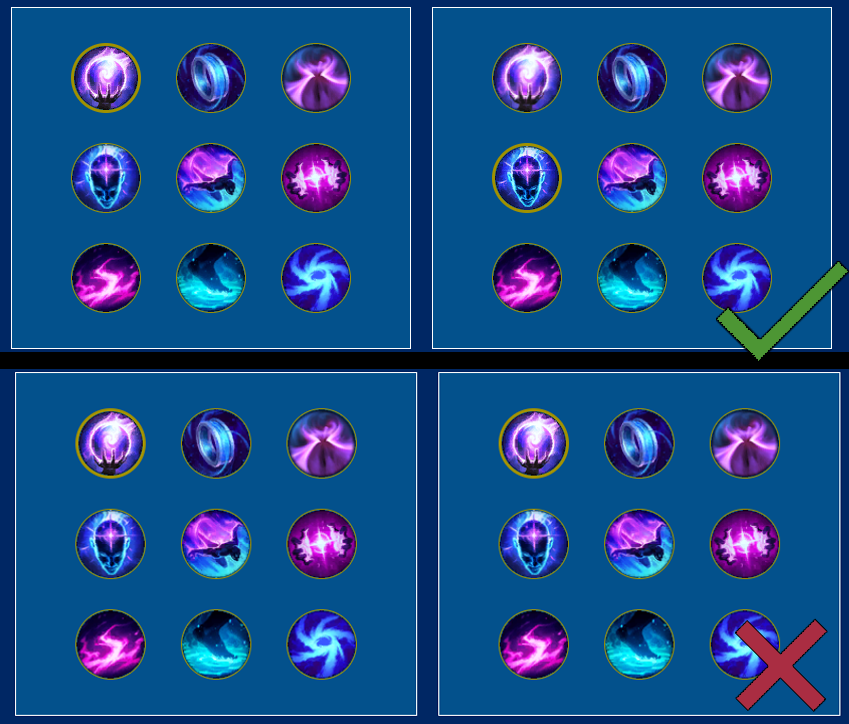
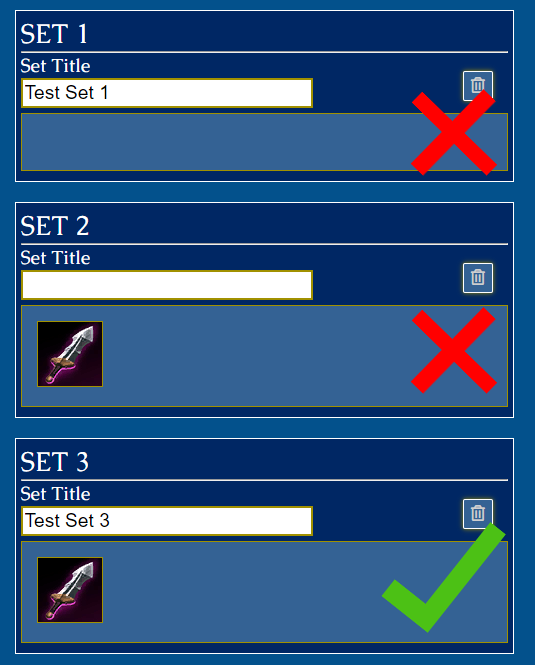

# League Strategie Infoblatt
### Autor: Damir Mavric
### Version: 2.0.0

--- 

## Ordnerstruktur meiner Webseite

Im Root Ordner sind die Index.php und die .htaccess Dateien zu finden. Alle anderen .php Seiten befinden sich im Ordner "pages".

Alle Dateien werden in Ihren gehörigen Ordnern verpackt, wo es Sinn ergibt, das heisst beispielsweise, dass alle Css Dateien in den "css" Ordner kommen.

Im Ordner "img" werden weitere Unterordner abgelegt, um Komplikationen zu vermeiden, dementsprechend werden alle Symbole in den Ordner "symbols" abgelegt, da es aber mehrere Symbole gibt, werden hierfür weitere logische Unterordner abgelegt.

Im "includes" Ordner werden alle PHP Dateien gespeichert, welche zur verschönerung, wiederverwendung und Fetching gebraucht werden.

Der Ordner "class" verwaltet die Datei mit der Klasse, welches zur verbindung der Datenbank, sowie aller Methoden verwendung findet.

---

## Css Dateistruktur

Meine Css Dateistruktur ist so aufgebaut, dass sich alle globalen css Einstellungen wie zum Beispiel der Css-Reset im brain.css importiert werden. Jede .php Seite hat seine eigene Css Datei (style_X.css, wobei X = Name der Webpage ist).

---  

## Login und Datenbank

### Zugangssdaten:

Die Zugangsdaten sind in den Ordner "includes" zu finden. Die Datei hat den Namen: "credentials.php".

### Admin Login

    Username: TestAdmin
    Passwort: Pstt43DD

Wenn ein Admin angemeldet ist, hat er die Möglichkeit, das Admin Dashboard aufzurufen, zudem hat er wie ein normaler User zugriff auf die Page "CreateGuide.php" und kann anfangen neue Guides zu League of Legends Champions zu erstellen.

Der Admin hat zugriff auf alle Guides und kann sie dementsprechend bearbeiten und löschen (Edit und Müll Symbol).

Momentan werden dem Admin nur die drei neusten User im Admin Dashboard angezeigt, geplant ist aber eine volle Ansicht von allen Usern (filterbar nach Rolle). Im Dashboard hat man die Möglichkeit den User zu löschen, beim Löschprozess wird nicht nur der User gelöscht, sondern auch alle Guides, welche vom gelöschten User erstellt wurden!

### Normaler User Login

    Username: TestUser
    Passwort: TestUser123

Der normale User hat jetzt auch Zugriff auf die "CreatePage.php" Seite und kann anfangen Guides für League of Legends zu erstellen.

Der User kann nur Guides, welche er selbst erstellt hat, bearbeiten oder löschen.

## Erstellung von Guides

Bei der Erstellung von Guides wird nach dem Champion, für welchen man einen Guide erstellen will, gefragt, zudem wird nach der Rolle, Runen Summoner spells und nach der Reihenfolge der zu maximierenden Fähigkeiten gefragt.

### Dies muss beim erstellen von League Guides beachtet werden:

1. "Your Title" und "Inhalt" dürfen nicht leer sein.

2. Ein Champion in "Your Champion" muss gewählt sein (So werden auch die Symbole in "Ability maxing order" Angezeigt).

3. In "Secondary Rune" dürfen in den zwei Containern nicht dieselbe Rune ausgewählt sein!

4. In "Your Summoner Spells" müssen Zweit ausgewählt sein! 

5. Die richtige Applikation startet in "Your Item Build". Wichtig ist, dass die Erstellung eines Itembuilds optional ist, der Benutzer hat die Möglichkeit, seinen Guide zu editieren und später ein Item Build hinzuzufügen. Mit dem Papierkorb Icon kann man ein Set löschen. Mit der Linken oder rechten Maustaste kann ein Item, welches sich in einem Set Container befindet, löschen. Da es viele verschiedene Items in League of Legends gibt, hat man die Möglichkeit, Items zu filtern.
Bei der Erstellung von Item Build gelten folgende Regeln:
    - Bei keinem Item Build gilt es keine Sets aktiv zu haben.
    - Ein Set muss ein Titel, sowie mindestens ein Item im Container haben.
    - Ein User kann maximal 9 Sets erstellen.
    - In einem Set können maximal 10 Items sein.

6. Die Auswahl in "Ability maxing order" muss Unique sein, heisst es dürfen nicht zwei oder mehrere male das Gleiche auswählt sein!

Beim Klicken auf den Button "Erstellen", wird der Guide, sofern keine Fehler gefunden wurden, in die Datenbank gespeichert.

Beim Editieren von Guides gelten dieselben regeln wie beim Erstellen.